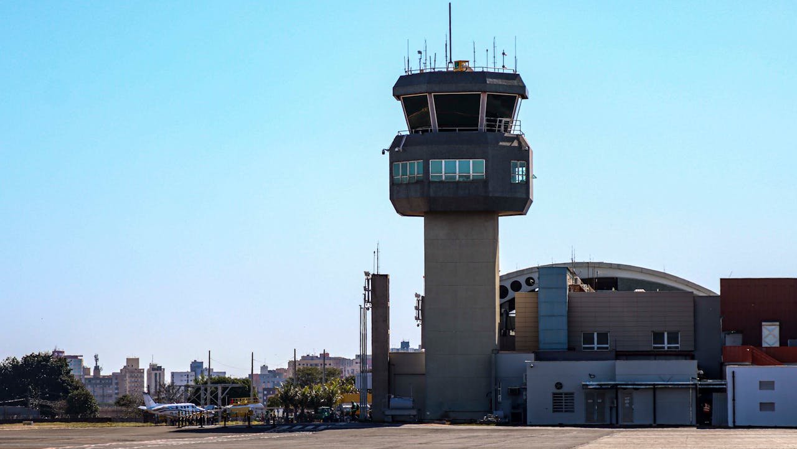

The central point of any airport is the **ATC**, commonly known as Air Traffic Controller(s). They are responsible for managing every single route an airplane takes in the air. In this blog post we will make a route management system to assist these individuals in their tasks.

# Searching
- partial ratio method used
- now listing the matches from highest ratio to lowest ratio
- add a minimum cutoff for the results, such as show the top 3 results.
- the airports can have numbers, where the user can type `use <index>` to select the airport.
- i can append the matches to a dictionary, with key value pairs for the airport and airport number

# Process

- once airports selected, shows both airports distance from each other, latitude, longitude and type of aircraft.

## Schedule Flights

- to be continued.
