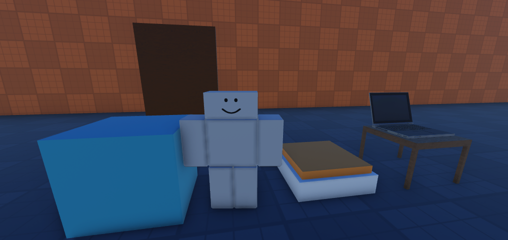
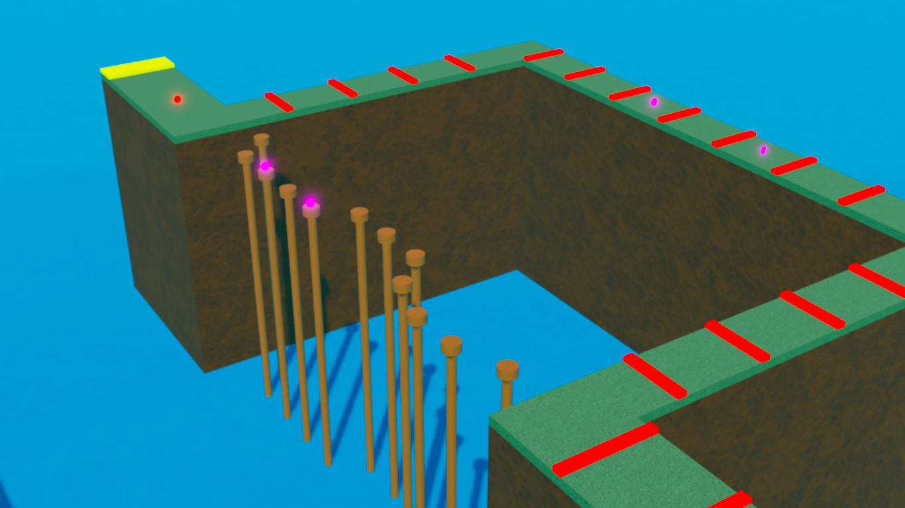
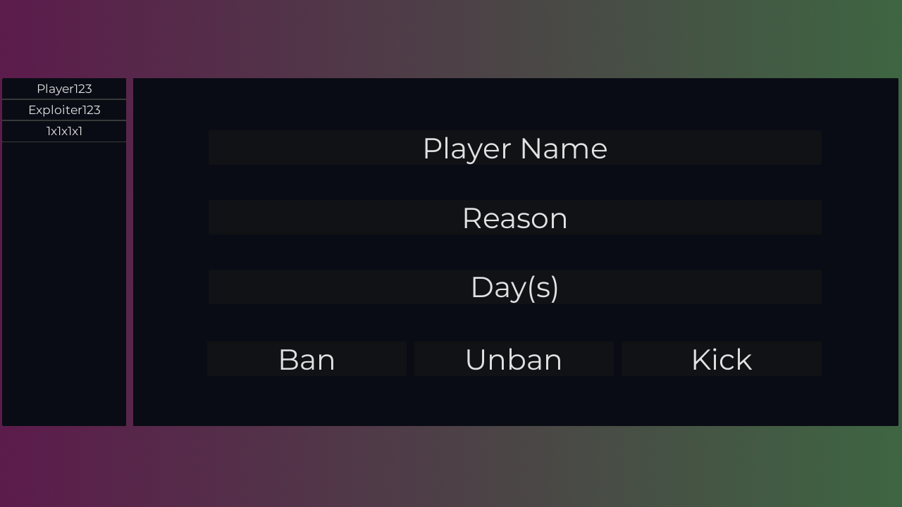

# Hi, I'm ANT.

Welcome to my Portfolio!

# About Me

* Scripting in Roblox since 2019.
* Worked on 5 serious projects.
* Combined game visits of over 7 million.

# My Skills

* Experience in developing **retro sword fighting** games.
* Created many **obby** games
* Experienced in **round systems**.
* Experienced in basic **data stores** including leaderboards.

# Contact Me

* **[Discord](https://discord.com/users/856760773032148993)**

# Creations
* Here are the projects and cool things I have made.

## Floppa Game System

  
  
  * Type: **Commission**
  * Showcase [CLICK HERE]: [_YouTube Video_](https://youtu.be/67LcP2Ave0w)
  * Created a game system inspired by **Raise a Floppa**
  
### Features
  
  * Pathfinding system using waypoints.
  * Data stores and stat saving system.
  * NPC dialogue system.
  * Buying and inventory system.

## Obstacle Course

* Type: **My Project**
* Showcase: [_YouTube Video_](https://youtu.be/H7yYtqlhNEY)
* Game incorporated a fast paced competitive gameplay along with doing parkour.

### Features
  
* Round system (2 players to play)
* Map voting system.

## Admin Panel

  * Type: **Commission**
  * Showcase: [_YouTube Video_](https://youtu.be/JJo7vWOocIs)
  * Solve the issue of game moderation with an admin panel!
  
### Features
  
  * Bans player across all servers in real time.
  * Player list, to quickly input username.
  
